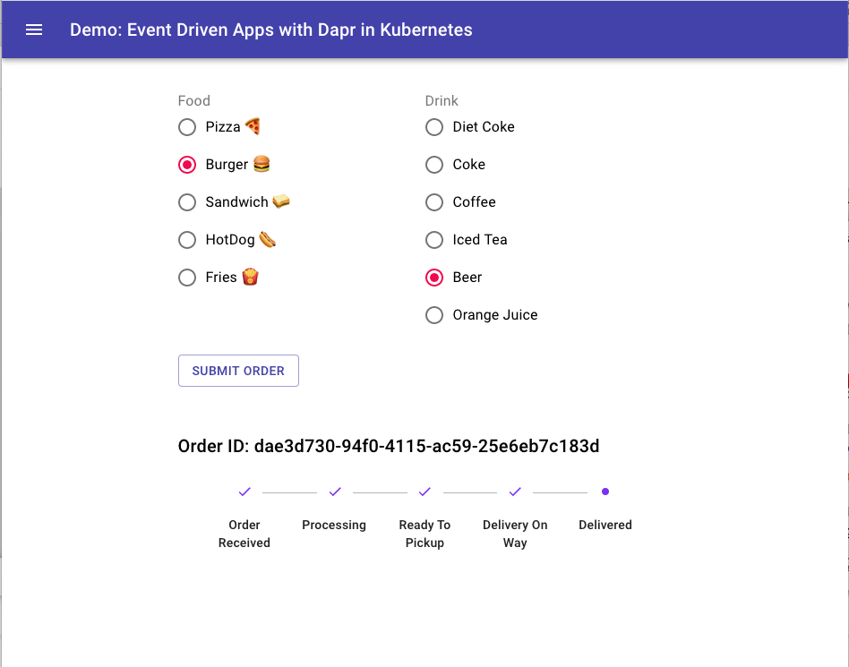

# Dapr Runtime Demo

Demo of Dapr runtime and seamless integration of cloud providers.

Presented at ONETUG July 9, 2020. Slides are [here](./docs/DaprTalk.pptx)

## Overview

This project demo explains how Dapr runtime supports the below items.

1. Event driven Architectures
2. Handling State Stores
3. Portability across Cloud / Edge deployments
4. Platform and Cloud Agnostic
5. Extensible Components.
7. Secret Stores
8. Deployments

## Getting Started

Please visit https://dapr.io for documentation and details. 

## Demo

## Deployments

- [Dapr Components](./components)
- [App Deployments](./k8s-deploy)
- [Github Actions](./github/workflows/deployToAksCluster.yml)

## Reference

- [Dapr Docs](https://github.com/dapr/docs)
- [Dapr Build Video](https://www.youtube.com/playlist?list=PLcip_LgkYwzu2ABITS_3cSV_6AeLsX-d0)
